### Code to select pandas columns that don’t include string

df_test =df_run.loc[:,\~(df_run.columns.str.startswith('logZ'))]

### code to turn a results list (starts as list with first row as column names)

results = [['set\#','R_square_train','MSE_train','R_square_test','MSE_test']]

…

results.append([i,R_sqare_train,train_mse,R_square_test,test_mse])

df_res=pd.DataFrame(results)

df_res.columns=df_res.iloc[0,:]

df_res = df_res[1:]

Getting started: from Git Bash to Jupyter notebooks
===================================================

Git Bash Terminal
-----------------

-   Launch Git Bash on Windows

    -   Can right click inside a folder in Windows and select GitBash to start
        in current folder

-   source activate learn-env \# Make sure to use learn-env

-   [!] New Conda Warning / Updating Your Learn-Env Packages

    -   If you see a message that states “WARNING: A newer version of conda
        exists” run :

-   conda update -n base conda \# and then try again to create the environment
    using:  
    conda env create -f environment.yml.

### [!] if Jupyter Notebook doesn’t have the Learn-env kernel as an option:

~~~~~~~~~~~~~~~~~~~~~~~~~~~~~~~~~~~~~~~~~~~~~~~~~~~~~~~~~~~~~~~~~~~~~~~~~~~~~~~~
       *python -m ipykernel install --user --name=learn-env*
~~~~~~~~~~~~~~~~~~~~~~~~~~~~~~~~~~~~~~~~~~~~~~~~~~~~~~~~~~~~~~~~~~~~~~~~~~~~~~~~

### General terminal commands

cd d: \# change to d drive before calling folders cd(‘D:/Users/My Name/My
Flatiron Files’) \# in quote cd .. \# move up one level

ls \# list folders in current directory pwd \# print working directory mkdir
\#new folder

Ctrl + C \# to interrupt kernel Ctrl + Shift + Insert \# to paste

Up Arrow / Down Arrow \# cycles through previous commands

### Cloning Git, Loading Jupyter Notebook

~~~~~~~~~~~~~~~~~~~~~~~~~~~~~~~~~~~~~~~~~~~~~~~~~~~~~~~~~~~~~~~~~~~~~~~~~~~~~~~~
source activate learn-env #gitbash
git clone <URL> # control+shift+insert to paste
cd(''D:/Users/My Name/My Flatiron Files'/new-cloned-git-learn-lesson/ # into clone, use 'ls' followed by  tab completion to speed things up

jupyter notebook #launches notebook in current dir         

Click on index.ipnb # Lessons are containeed in index.ipnb*
Click Kernel > Change Kernel > learn-env
~~~~~~~~~~~~~~~~~~~~~~~~~~~~~~~~~~~~~~~~~~~~~~~~~~~~~~~~~~~~~~~~~~~~~~~~~~~~~~~~

### Pushing notebooks back to git

~~~~~~~~~~~~~~~~~~~~~~~~~~~~~~~~~~~~~~~~~~~~~~~~~~~~~~~~~~~~~~~~~~~~~~~~~~~~~~~~
    git add
    git commit -m "Comments go here"
    git push       
~~~~~~~~~~~~~~~~~~~~~~~~~~~~~~~~~~~~~~~~~~~~~~~~~~~~~~~~~~~~~~~~~~~~~~~~~~~~~~~~

Jupyter Notebook Hotkeys & Mouse Tricks
---------------------------------------

-   Shift + Tab \# inside method/function () for help

-   % matplotlib inline \#for graphs in notebook

-   ctrl+/ \# comment / uncomment selection

-   shift + enter \#run cell, select below.

-   ctrl + enter \# run cell.

-   alt + enter \#run cell, insert below.

-   A \# insert cell above.

-   B \# insert cell below.

-   C \# copy cell.

-   V \# paste cell.

-   X \# delete selected cell.

-   Y \# change cell to code

-   M \# change cell to markdown

-   Ctrl +Click \# create multiple cursors at once (edit simultaneously)

Built-In Python Functions/Methods/Indexing:
===========================================

~~~~~~~~~~~~~~~~~~~~~~~~~~~~~~~~~~~~~~~~~~~~~~~~~~~~~~~~~~~~~~~~~~~~~~~~~~~~~~~~
    len(), type()
    var+=1 # can add / sub 
    
    set(list) # returns unique values
    
    list(range(0,len(variable))) # create numerical index for variable length
    round(result,num_decimals) # Display only 2 decimal places+
~~~~~~~~~~~~~~~~~~~~~~~~~~~~~~~~~~~~~~~~~~~~~~~~~~~~~~~~~~~~~~~~~~~~~~~~~~~~~~~~

List Indexing:
--------------

~~~~~~~~~~~~~~~~~~~~~~~~~~~~~~~~~~~~~~~~~~~~~~~~~~~~~~~~~~~~~~~~~~~~~~~~~~~~~~~~
        list=['str','str']
        data[0:5] # select data elements 1-4
        data[5:] # select 5 to the end
        data[0:end:2] #Select every other ek
        data[-1] #last element
~~~~~~~~~~~~~~~~~~~~~~~~~~~~~~~~~~~~~~~~~~~~~~~~~~~~~~~~~~~~~~~~~~~~~~~~~~~~~~~~

List Methods
------------

~~~~~~~~~~~~~~~~~~~~~~~~~~~~~~~~~~~~~~~~~~~~~~~~~~~~~~~~~~~~~~~~~~~~~~~~~~~~~~~~
    list.append()
    list.pop()
    list.extend() #joins 2 list
    list.insert()
    list.remove()
    list.count()
~~~~~~~~~~~~~~~~~~~~~~~~~~~~~~~~~~~~~~~~~~~~~~~~~~~~~~~~~~~~~~~~~~~~~~~~~~~~~~~~

String methods
--------------

~~~~~~~~~~~~~~~~~~~~~~~~~~~~~~~~~~~~~~~~~~~~~~~~~~~~~~~~~~~~~~~~~~~~~~~~~~~~~~~~
    str.upper()
    str.lower()
    str.capitalize() 
    str.title() 

    str.strip()
    str.endswith(txt)
    str.startswith(txt)
    str.split('_')
    str=f'This string references my {variable} named variable.'
    
     # Print vars inside of strings with f-string formatting
    print(f'My str will have {variable_names} inserted into it.')
~~~~~~~~~~~~~~~~~~~~~~~~~~~~~~~~~~~~~~~~~~~~~~~~~~~~~~~~~~~~~~~~~~~~~~~~~~~~~~~~

~~~~~~~~~~~~~~~~~~~~~~~~~~~~~~~~~~~~~~~~~~~~~~~~~~~~~~~~~~~~~~~~~~~~~~~~~~~~~~~~
    list.reverse()
    list.sort() # doesn't return a value 
    s=sorted(list,key_func,reverse=True)
    
    
    filtered_list = filter(func_that_filters, orignal_long_list )
~~~~~~~~~~~~~~~~~~~~~~~~~~~~~~~~~~~~~~~~~~~~~~~~~~~~~~~~~~~~~~~~~~~~~~~~~~~~~~~~

Dictionary Indexing:
--------------------

~~~~~~~~~~~~~~~~~~~~~~~~~~~~~~~~~~~~~~~~~~~~~~~~~~~~~~~~~~~~~~~~~~~~~~~~~~~~~~~~
    new_dict=dict()
    ex_dict  = {'key1' : value1 , 'key2' : value2}
    
    ex_dict['key1'] [element_index]# returns element from value1
    
    key_to_add='Name'
    ex_dict[key_to_add]= 2 
    
    ex_dict.keys() # returns all keys
    ex_dict.values() # returns all values
    ex_dict.items() # returns all items

    ex_dict.get(var, value_if_DNE) #DNE=does not exist 
    
~~~~~~~~~~~~~~~~~~~~~~~~~~~~~~~~~~~~~~~~~~~~~~~~~~~~~~~~~~~~~~~~~~~~~~~~~~~~~~~~

### Ex: Updating a dictionary value (if it exists) by looping through an iterable

~~~~~~~~~~~~~~~~~~~~~~~~~~~~~~~~~~~~~~~~~~~~~~~~~~~~~~~~~~~~~~~~~~~~~~~~~~~~~~~~
        words=txt.split() # A long list of strings
        word_counts={} # Empty dictionary
    
        #Loop through words list 
        for word in words:
            word_counts[word] = word_counts.get(word, 0_ ) #dict.get(key, default_value)
~~~~~~~~~~~~~~~~~~~~~~~~~~~~~~~~~~~~~~~~~~~~~~~~~~~~~~~~~~~~~~~~~~~~~~~~~~~~~~~~

Flow control (conditionals and loops)
-------------------------------------

### If, elif, else

~~~~~~~~~~~~~~~~~~~~~~~~~~~~~~~~~~~~~~~~~~~~~~~~~~~~~~~~~~~~~~~~~~~~~~~~~~~~~~~~
if <condition>:
        code_to_run
    elif other_condition:
        other_code_to_run
    else:
        otherwise_run_code
    # Ends via indentation
~~~~~~~~~~~~~~~~~~~~~~~~~~~~~~~~~~~~~~~~~~~~~~~~~~~~~~~~~~~~~~~~~~~~~~~~~~~~~~~~

~~~~~~~~~~~~~~~~~~~~~~~~~~~~~~~~~~~~~~~~~~~~~~~~~~~~~~~~~~~~~~~~~~~~~~~~~~~~~~~~
### try, except 
    try:
        df = pd.read_csv('Data/Yelp_Reviews_Corrupt.csv')
    except Exception as e:
        print(e)
~~~~~~~~~~~~~~~~~~~~~~~~~~~~~~~~~~~~~~~~~~~~~~~~~~~~~~~~~~~~~~~~~~~~~~~~~~~~~~~~

### For loops

~~~~~~~~~~~~~~~~~~~~~~~~~~~~~~~~~~~~~~~~~~~~~~~~~~~~~~~~~~~~~~~~~~~~~~~~~~~~~~~~
    for element in iterable:
        'run this code'

    *for key, value in exampl_dictionary.items()*
        'run this code'
~~~~~~~~~~~~~~~~~~~~~~~~~~~~~~~~~~~~~~~~~~~~~~~~~~~~~~~~~~~~~~~~~~~~~~~~~~~~~~~~

### While loops

Defining functions
------------------

~~~~~~~~~~~~~~~~~~~~~~~~~~~~~~~~~~~~~~~~~~~~~~~~~~~~~~~~~~~~~~~~~~~~~~~~~~~~~~~~
    def function_name(parameters_in=default_value:  #can do (), but variables must already exist
        str='run this code'
        return value_to_send_back
~~~~~~~~~~~~~~~~~~~~~~~~~~~~~~~~~~~~~~~~~~~~~~~~~~~~~~~~~~~~~~~~~~~~~~~~~~~~~~~~

Lambda functions
----------------

~~~~~~~~~~~~~~~~~~~~~~~~~~~~~~~~~~~~~~~~~~~~~~~~~~~~~~~~~~~~~~~~~~~~~~~~~~~~~~~~
    df['column'] = df.column_to_operate_on.map(lambda x:  'N' in x)
~~~~~~~~~~~~~~~~~~~~~~~~~~~~~~~~~~~~~~~~~~~~~~~~~~~~~~~~~~~~~~~~~~~~~~~~~~~~~~~~

List Comprehensions
-------------------

GRAPHING WITH MATPLOTLIB
========================

~~~~~~~~~~~~~~~~~~~~~~~~~~~~~~~~~~~~~~~~~~~~~~~~~~~~~~~~~~~~~~~~~~~~~~~~~~~~~~~~
    import matplotlib.pyplot as plt
    %matplotlib inline # onlu jupyter notebooks
    
    plt.figure(figsize=(x,y))

    data_to_graph.plot(kind='barh') # default is line
~~~~~~~~~~~~~~~~~~~~~~~~~~~~~~~~~~~~~~~~~~~~~~~~~~~~~~~~~~~~~~~~~~~~~~~~~~~~~~~~

Can call plotting *functions:*

~~~~~~~~~~~~~~~~~~~~~~~~~~~~~~~~~~~~~~~~~~~~~~~~~~~~~~~~~~~~~~~~~~~~~~~~~~~~~~~~
    plt.scatter(x,y)
    plt.hist(x,bins=num)

    plt.title('Top 5 Lego Themes', fontsize=16) #fontsize is optional
    plt.xlabel('Number of Lego Sets') #you could also pass in fontsize if you wanted here
    plt.ylabel('Theme') #you could also rotate text if you wanted

    plt.legend()
    plt.show()
~~~~~~~~~~~~~~~~~~~~~~~~~~~~~~~~~~~~~~~~~~~~~~~~~~~~~~~~~~~~~~~~~~~~~~~~~~~~~~~~

### Matplotlib from lesson - two subplots:

~~~~~~~~~~~~~~~~~~~~~~~~~~~~~~~~~~~~~~~~~~~~~~~~~~~~~~~~~~~~~~~~~~~~~~~~~~~~~~~~
    # Define a new figure with matplotlib's .plot() function. Set the size of figure space
    new_figure = plt.figure(figsize=(10,4))
    # Add a subplot to the figure - a new axes
    ax = new_figure.add_subplot(121)
    # Add a second subplot to the figure - a new axes
    ax2 = new_figure.add_subplot(122)
    # Generate a line plot on first axes
    ax.plot([1, 4, 6, 8], [10, 15, 27, 32], color='lightblue', linewidth=3, linestyle = '-.')
    # Draw a scatter plot on 2nd axes
    ax2.scatter([0.5, 2.2, 4.2, 6.5], [21, 19, 9, 26], color='red', marker='o')
    # Set the limits of x and y for first axes
    ax.set_xlim(0, 9), ax.set_ylim(5,35)
    # Set the limits of x and y for 2nd axes
    ax2.set_xlim(0, 9), ax2.set_ylim(5,35)
    # Show the plot
    plt.show()
~~~~~~~~~~~~~~~~~~~~~~~~~~~~~~~~~~~~~~~~~~~~~~~~~~~~~~~~~~~~~~~~~~~~~~~~~~~~~~~~

### Matplotlib from lesson - inset subplot

~~~~~~~~~~~~~~~~~~~~~~~~~~~~~~~~~~~~~~~~~~~~~~~~~~~~~~~~~~~~~~~~~~~~~~~~~~~~~~~~
    # Generate sample data 
    x = np.linspace(0, 5, 11)
    y = x ** 3

    # Creates blank canvas
    figure = plt.figure()

    # Add new axes to the figure with absolute positions
    ax1 = figure.add_axes([0.1, 0.1, 0.8, 0.8]) # main axes
    ax2 = figure.add_axes([0.2, 0.5, 0.4, 0.3]) # inset axes

    # Larger Figure Axes 1
    ax1.plot(x, y, color = 'blue', linestyle = '-.')
    ax1.set_xlabel('X_label on axes1')
    ax1.set_ylabel('Y_label on axes1')
    ax1.set_title('Axes 1 Title')

    # Insert Figure Axes 2
    ax2.plot(y, x, color = 'green', linestyle = '--')
    ax2.set_xlabel('X_label on axes2')
    ax2.set_ylabel('Y_label on axes2')
    ax2.set_title('Axes 2 Title')

    plt.show()
~~~~~~~~~~~~~~~~~~~~~~~~~~~~~~~~~~~~~~~~~~~~~~~~~~~~~~~~~~~~~~~~~~~~~~~~~~~~~~~~

~~~~~~~~~~~~~~~~~~~~~~~~~~~~~~~~~~~~~~~~~~~~~~~~~~~~~~~~~~~~~~~~~~~~~~~~~~~~~~~~

~~~~~~~~~~~~~~~~~~~~~~~~~~~~~~~~~~~~~~~~~~~~~~~~~~~~~~~~~~~~~~~~~~~~~~~~~~~~~~~~

~~~~~~~~~~~~~~~~~~~~~~~~~~~~~~~~~~~~~~~~~~~~~~~~~~~~~~~~~~~~~~~~~~~~~~~~~~~~~~~~

~~~~~~~~~~~~~~~~~~~~~~~~~~~~~~~~~~~~~~~~~~~~~~~~~~~~~~~~~~~~~~~~~~~~~~~~~~~~~~~~

My Histograms from PDF lab
--------------------------

>   fig2=plt.figure()

>   male_df['Height'].plot(kind='hist',color='blue',edgecolor='pink',label='Male',density=True,alpha=0.7)

>   female_df['Height'].plot(kind='hist',color='pink',edgecolor='blue',label='Female',density=True,alpha=0.7)

>   plt.xlabel('Height (inches)')

>   plt.ylabel('Frequency')

>   plt.legend()

>   \# You code here

>   x_male,y_male=density(male_df['Height'])

>   plt.plot(x_male,y_male,':',color='cyan',linewidth=3)

>   x_female,y_female=density(female_df['Height'])

>   plt.plot(x_female,y_female,'--',color='magenta',linewidth=3)

>   plt.show()

PANDAS AND DATAFRAMES
=====================

~~~~~~~~~~~~~~~~~~~~~~~~~~~~~~~~~~~~~~~~~~~~~~~~~~~~~~~~~~~~~~~~~~~~~~~~~~~~~~~~
    
~~~~~~~~~~~~~~~~~~~~~~~~~~~~~~~~~~~~~~~~~~~~~~~~~~~~~~~~~~~~~~~~~~~~~~~~~~~~~~~~

~~~~~~~~~~~~~~~~~~~~~~~~~~~~~~~~~~~~~~~~~~~~~~~~~~~~~~~~~~~~~~~~~~~~~~~~~~~~~~~~
# import pandas as pd
    dataframe= pd.read_csv('filename.csv',header=1, encoding='latin-1',usecols=[1,2,3])
    df=pd.read_excel('filename.xlsx',sheet_name='sheet name')
    
    workbook = pd.ExcelFile('filename.xlsx')
    workbook.sheet_names
    df = workbook.parse(sheet_name=1)

    df.to_csv('file.csv',index=False) #create csv file
    df.to_excel() #excel 
    df.to_dict()
~~~~~~~~~~~~~~~~~~~~~~~~~~~~~~~~~~~~~~~~~~~~~~~~~~~~~~~~~~~~~~~~~~~~~~~~~~~~~~~~

Pandas methods and functions
----------------------------

~~~~~~~~~~~~~~~~~~~~~~~~~~~~~~~~~~~~~~~~~~~~~~~~~~~~~~~~~~~~~~~~~~~~~~~~~~~~~~~~
    df.head() # display first few rows ; can do df.column.head()
    df.tail()
    df.info() #
    df.shape() # rows and columns-
    df.describe() # quick statistics for all of dataframe
    df.dtypes()
    df.index()
    df.columns()
    df.drop() 
    df.set_index('column')
    df.reset_index()
~~~~~~~~~~~~~~~~~~~~~~~~~~~~~~~~~~~~~~~~~~~~~~~~~~~~~~~~~~~~~~~~~~~~~~~~~~~~~~~~

### Dataframe Indexing

~~~~~~~~~~~~~~~~~~~~~~~~~~~~~~~~~~~~~~~~~~~~~~~~~~~~~~~~~~~~~~~~~~~~~~~~~~~~~~~~
# For series/column
    df['col_ name'] # OR:
    df.col_Name
# For rows ..?
    # []TBD!

# Index data by position .iloc[ ]
    df.iloc[row_idx_start : row_idx_exclusive, col_idx_start: col_idx_end] # slice row row_idx

# Index data using .loc[]: 
    # Index based upon their labels (row index and column name)
        df.loc[row1:rowEnd,'column_name' ]     

    # Index based upon conditional (boolean) statements
        df.loc[df['col_to_test'] < condition1 ]
        singe_col_filtered = df.loc[df['col_to_test'] < condition1, ['column_name']]

    # Index based upon two conditionals
        df.loc[(df["col_to_test1"] == condition1) & (df["col_to_test2"]== condition2)]

    # Changing values via .loc indexing
        df.loc[df["color_intensity"]>10, "color_intensity"] = 10

    # Changing values if contain string
        df.loc[df["Home Team Name"].str.contains('Korea'), "Home Team Name" ]        
~~~~~~~~~~~~~~~~~~~~~~~~~~~~~~~~~~~~~~~~~~~~~~~~~~~~~~~~~~~~~~~~~~~~~~~~~~~~~~~~

### Useful pandas series methods:

~~~~~~~~~~~~~~~~~~~~~~~~~~~~~~~~~~~~~~~~~~~~~~~~~~~~~~~~~~~~~~~~~~~~~~~~~~~~~~~~
    df.col_name.value_counts() #[0:5]
    df.col_name.astype()
    series.mean() #Changing notation here: series refers to df.col_name (which is a series)!
    series.median()
    series.min()
    series.max()
    series.std()
    series.unique()
    series.nunique()
    series.sample()
    series.sort_values()
    series.hist()
~~~~~~~~~~~~~~~~~~~~~~~~~~~~~~~~~~~~~~~~~~~~~~~~~~~~~~~~~~~~~~~~~~~~~~~~~~~~~~~~

~~~~~~~~~~~~~~~~~~~~~~~~~~~~~~~~~~~~~~~~~~~~~~~~~~~~~~~~~~~~~~~~~~~~~~~~~~~~~~~~
# USING MAP TO OPERATE ON A DATA FRAME
df[‘column’].map(lambda x: len(x.split()).head()
#LAMBDA + MAP FUNCTIONS WITH CONDITIONALS
df['text'].map(lambda x: 'Good' if any([word in x.lower() for word in ['awesome', 'love', 'great']]) else 'Bad').head()
~~~~~~~~~~~~~~~~~~~~~~~~~~~~~~~~~~~~~~~~~~~~~~~~~~~~~~~~~~~~~~~~~~~~~~~~~~~~~~~~

~~~~~~~~~~~~~~~~~~~~~~~~~~~~~~~~~~~~~~~~~~~~~~~~~~~~~~~~~~~~~~~~~~~~~~~~~~~~~~~~

~~~~~~~~~~~~~~~~~~~~~~~~~~~~~~~~~~~~~~~~~~~~~~~~~~~~~~~~~~~~~~~~~~~~~~~~~~~~~~~~

### Examples: using pandas

#### Ex from lesson: conditional indexing

~~~~~~~~~~~~~~~~~~~~~~~~~~~~~~~~~~~~~~~~~~~~~~~~~~~~~~~~~~~~~~~~~~~~~~~~~~~~~~~~
    # Index based upon an  3 variables, var1/cond1 & (var2/cond2 | var3/cond3)} # / just means var+ condition 
    USA_home_and_away = df[(df.Year==2014)  & ((df['Home Team Name'] == 'USA') | (df['Away Team Name']=='USA'))
~~~~~~~~~~~~~~~~~~~~~~~~~~~~~~~~~~~~~~~~~~~~~~~~~~~~~~~~~~~~~~~~~~~~~~~~~~~~~~~~

#### Ex from lesson: operating on dataframes (change names, cols)

~~~~~~~~~~~~~~~~~~~~~~~~~~~~~~~~~~~~~~~~~~~~~~~~~~~~~~~~~~~~~~~~~~~~~~~~~~~~~~~~
    # Drop a column of the df
    df = df.drop('C/A', axis=1) #drop the COLUMN(axis=1) 'C/A'

    # Rename columns
    df = df.rename(columns={'DATE' : 'date'})
        
    # Operate on columns names
    new_cols = [col.lower() for col in df.columns]                       
    df.columns = [my_function(col) for col in df.columns] 
~~~~~~~~~~~~~~~~~~~~~~~~~~~~~~~~~~~~~~~~~~~~~~~~~~~~~~~~~~~~~~~~~~~~~~~~~~~~~~~~

#### Ex from lessons: using datetime type

~~~~~~~~~~~~~~~~~~~~~~~~~~~~~~~~~~~~~~~~~~~~~~~~~~~~~~~~~~~~~~~~~~~~~~~~~~~~~~~~
df.DATE = pd.to_datetime(df.DATE, format='%m/%d/%Y') # convert dates to datetime type
df.DATE.dt.day_name() #dt.day_name
df['Dayofweek'] = df.DATE.dt.dayofweek 
~~~~~~~~~~~~~~~~~~~~~~~~~~~~~~~~~~~~~~~~~~~~~~~~~~~~~~~~~~~~~~~~~~~~~~~~~~~~~~~~

\`\`\`

### Groupby

~~~~~~~~~~~~~~~~~~~~~~~~~~~~~~~~~~~~~~~~~~~~~~~~~~~~~~~~~~~~~~~~~~~~~~~~~~~~~~~~
        grouped = df.groupby('Dayofweek').sum()
        grouped.plot(kind='barh')

        df['Num_Lines'] = df.LINENAME.map(lambda x: len(x)) # HMmm weird


        ### Using .applymap()
        string_df=df.applymap(lambda x: str(x))

        ### Dataframe statistics methods
         (.mean(), .std(), .count(), .sum(), .mean(), .median(), .std(), .var() and .quantile())
~~~~~~~~~~~~~~~~~~~~~~~~~~~~~~~~~~~~~~~~~~~~~~~~~~~~~~~~~~~~~~~~~~~~~~~~~~~~~~~~

!TO DO! Graphing with Pandas
----------------------------

~~~~~~~~~~~~~~~~~~~~~~~~~~~~~~~~~~~~~~~~~~~~~~~~~~~~~~~~~~~~~~~~~~~~~~~~~~~~~~~~
import pandas as pd
~~~~~~~~~~~~~~~~~~~~~~~~~~~~~~~~~~~~~~~~~~~~~~~~~~~~~~~~~~~~~~~~~~~~~~~~~~~~~~~~

HOW TO: DATA EXPLORATORY ANALYSIS & MUNGING 
--------------------------------------------

>   Workflow from Pandas Lab.  
>   *\# DATA EXPLORATORY ANALYSIS*  
>   **\* Understanding the dimensionality of your dataset**

>   **\* Investigating what type of data it contains, and the data types used to
>   store it**

>   **\* Discovering how missing values are encoded, and how many there are**

>   **\* Getting a feel for what information it does and doesnt contain**

>   \# Load in standard packages

>   import pandas as pd  
>   import numpy as np  
>   import seaborn as sns  
>   import matplotlib.pyplot as plt  
>   %matplotlib inline

>     
>   *\#1 Load the dataset and display header*  
>   `import pandas as pd  
>   df=pd.read_csv(‘Data.csv’)  
>   df.head(2)`

~~~~~~~~~~~~~~~~~~~~~~~~~~~~~~~~~~~~~~~~~~~~~~~~~~~~~~~~~~~~~~~~~~~~~~~~~~~~~~~~
#2 Drop any unwanted Unnamed Index Columns
df.drop(‘Unnamed: 0’, axis=1, inplace=True) #axis =1 to spec columns
~~~~~~~~~~~~~~~~~~~~~~~~~~~~~~~~~~~~~~~~~~~~~~~~~~~~~~~~~~~~~~~~~~~~~~~~~~~~~~~~

>   *\#3 Use .info() to check and change datatypes*`  
>   print('DF INFORMATION:\n')  
>   print(df.info())  
>   print('\n')  
>     
>   `*\# Check for NaN Values, Missing, and Odd Categorical Values*  
>   print(f'NaN values in data? \\n {heroes_df.isna().any().any()}\\n')  
>   print(f'Num missing: {heroes_df.Publisher.isna().sum()} out of
>   {len(heroes_df.Publisher)}, ({round((heroes_df.Publisher.isna().sum()
>   /len(heroes_df.Publisher) \* 100),2) }%)')  
>   print('heroes_df - Missing Publisher values:'.upper())  
>   print(f'{df.Publisher.isna().sum()/len(heroes_df.Publisher)\*100}%')  
>   print('\\n')

~~~~~~~~~~~~~~~~~~~~~~~~~~~~~~~~~~~~~~~~~~~~~~~~~~~~~~~~~~~~~~~~~~~~~~~~~~~~~~~~
# Check for Check for Redundancy
print(f'Num unique: {len(df.Categorical_Col.unique())}')
~~~~~~~~~~~~~~~~~~~~~~~~~~~~~~~~~~~~~~~~~~~~~~~~~~~~~~~~~~~~~~~~~~~~~~~~~~~~~~~~

~~~~~~~~~~~~~~~~~~~~~~~~~~~~~~~~~~~~~~~~~~~~~~~~~~~~~~~~~~~~~~~~~~~~~~~~~~~~~~~~
# DEALING WITH NULL VALUES
# Choices are 1) to drop the missing data (row or col)
~~~~~~~~~~~~~~~~~~~~~~~~~~~~~~~~~~~~~~~~~~~~~~~~~~~~~~~~~~~~~~~~~~~~~~~~~~~~~~~~

~~~~~~~~~~~~~~~~~~~~~~~~~~~~~~~~~~~~~~~~~~~~~~~~~~~~~~~~~~~~~~~~~~~~~~~~~~~~~~~~
[BOOKMARK]# 
~~~~~~~~~~~~~~~~~~~~~~~~~~~~~~~~~~~~~~~~~~~~~~~~~~~~~~~~~~~~~~~~~~~~~~~~~~~~~~~~

~~~~~~~~~~~~~~~~~~~~~~~~~~~~~~~~~~~~~~~~~~~~~~~~~~~~~~~~~~~~~~~~~~~~~~~~~~~~~~~~
print('   HEROES_DF INFORMATION:\n')
    print(heroes_df.info())
    print('\n')
    # print('heroes_df value counts (check for redundancy):')
    # print(heroes_df['name'].value_counts()[0:10])
    # print('\n\n')

    print(f'NaN values in data? \n {heroes_df.isna().any().any()}\n')

    # print('heroes_df names - Number of Redundant:'.upper())
    # print(f'Num unique names: {len(heroes_df.name.unique())}')
    # print(f'Num of repeated names: {len(heroes_df.name)-len(heroes_df.name.unique())}')
    # print('\n')

    print('heroes_df -  Missing Publisher values:'.upper())
    #print(f'Num unique: {len(heroes_df.Publisher.unique())}')
    print(f'Num missing: {heroes_df.Publisher.isna().sum()} out of {len(heroes_df.Publisher)}, ({round((heroes_df.Publisher.isna().sum() /len(heroes_df.Publisher) * 100),2) }%)')
    # print(f'{heroes_df.Publisher.isna().sum()/len(heroes_df.Publisher)*100}%')
    print('\n')

    print('heroes_df - Missing Weight values:'.upper())
    # print(f'Num missing: {heroes_df.Weight.isna().sum()}')
    print(f'Num missing: {heroes_df.Weight.isna().sum()} out of {len(heroes_df.Weight)}, ({round((heroes_df.Weight.isna().sum() /len(heroes_df.Weight) * 100),2) }%)')
    print('\n')–
~~~~~~~~~~~~~~~~~~~~~~~~~~~~~~~~~~~~~~~~~~~~~~~~~~~~~~~~~~~~~~~~~~~~~~~~~~~~~~~~

SQL (sect 05)
=============

Using sqlite3 with SQL databases
--------------------------------

~~~~~~~~~~~~~~~~~~~~~~~~~~~~~~~~~~~~~~~~~~~~~~~~~~~~~~~~~~~~~~~~~~~~~~~~~~~~~~~~
import sqlite3
connection = sqlite3.connect('pet_database.db') # Creates pet_database, but empty until create a table    
cursor = connection.cursor()

# use the corsor to execute sql commands
cursor.execute(''' 
CREATE TABLE cats (
    id INTEGER PRIMARY KEY,
    name TEXT,
    age INTEGER,
    breed TEXT
)
''')

# Insert into table
cursor.execute('''INSERT INTO cats (name, age, breed) VALUES ('Maru', 3, 'Scottish Fold');''')
# Select from table
cursor.execute('''SELECT name FROM cats;''').fetchall()

# Select only distinct entries
cursor.execute('''SELECT DISTINCT name FROM cats;''').fetchall()
# Selecting by conditionals using WHERE
cursor.execute('''SELECT * FROM [table name] WHERE [column name] = [some value];''').fetchall()

# Altering a table 
cursor.execute('''ALTER TABLE cats ADD COLUMN notes text;''')
# Updating data
cursor.execute('''UPDATE [table name] SET [column name] = [new value] WHERE [column name] = [value];''')
# Deleting data
cursor.execute('''DELETE FROM [table name] WHERE [column name] = [value];''')
~~~~~~~~~~~~~~~~~~~~~~~~~~~~~~~~~~~~~~~~~~~~~~~~~~~~~~~~~~~~~~~~~~~~~~~~~~~~~~~~

Some Notes on Displaying Query Outputs
--------------------------------------

\`\`\`python import pandas as pd \#Demonstrating running a query and previewing
results as pandas DataFrame results = cursor.execute(""“select \* from
planets;”"").fetchall()  
df = pd.DataFrame(results) df. columns = [i[0] for i in cursor.description]
df.head()

~~~~~~~~~~~~~~~~~~~~~~~~~~~~~~~~~~~~~~~~~~~~~~~~~~~~~~~~~~~~~~~~~~~~~~~~~~~~~~~~
# CAN MAKE A FUNCTION TO SIMPLIFY
def sql_select_to_df(SQL_COMMAND, cur=cursor):
    results = cur.execute(SQL_COMMAND).fetchall()
    df = pd.DataFrame(results)
    df.columns = [i[0] for i in cur.description]
    return df

# Call function to select data
df = sql_select_to_df("""select * from planets;""")
df.head()

# Select with function + conditional
df=sql_select_to_df("""SELECT * FROM planets WHERE mass > 1;""")
df.head()

# Select with AND 
df=sql_select_to_df("""SELECT * FROM planets WHERE (num_of_moons>1 AND mass < 1);""")
df.head()```
~~~~~~~~~~~~~~~~~~~~~~~~~~~~~~~~~~~~~~~~~~~~~~~~~~~~~~~~~~~~~~~~~~~~~~~~~~~~~~~~

Filtering and Ordering
----------------------

~~~~~~~~~~~~~~~~~~~~~~~~~~~~~~~~~~~~~~~~~~~~~~~~~~~~~~~~~~~~~~~~~~~~~~~~~~~~~~~~
# ORDER BY
cursor.execute('''SELECT column_name FROM table_name ORDER BY column_name ASC|DESC;''').fetchall()
# LIMIT
cursor.execute('''SELECT * FROM cats ORDER BY age DESC LIMIT 3;''').fetchall() #Fetch top 3
cursor.execute('''SELECT * FROM cats ORDER BY age DESC;''').fetchone() #returns the first 
# BETWEEN
cursor.execute('''SELECT column_name(s) FROM table_name WHERE column_name BETWEEN value1 AND value2;''').fetchall()
# NULL - placeholder
cursor.execute('''INSERT INTO cats (name, age, breed) VALUES (NULL, NULL, "Tabby");''')
#SELECT BY NULL
SELECT * FROM cats WHERE name IS NULL;
# COUNT
SELECT COUNT([column name]) FROM [table name] WHERE [column name] = [value];
# GROUPBY
SELECT breed, COUNT(breed) FROM cats GROUP BY breed;
SELECT breed, owner_id, COUNT(breed) FROM cats GROUP BY breed, owner_id;
~~~~~~~~~~~~~~~~~~~~~~~~~~~~~~~~~~~~~~~~~~~~~~~~~~~~~~~~~~~~~~~~~~~~~~~~~~~~~~~~

Object-Oriented Programming (Sect 06-07)-
=========================================

Defining classes
----------------

~~~~~~~~~~~~~~~~~~~~~~~~~~~~~~~~~~~~~~~~~~~~~~~~~~~~~~~~~~~~~~~~~~~~~~~~~~~~~~~~
# Must define class NameConventionCase
class MyNewClass: 
    pass # If no attributes, must pass
# Instantiate an MyNewClass object
new_instance = MyNewClass() 
~~~~~~~~~~~~~~~~~~~~~~~~~~~~~~~~~~~~~~~~~~~~~~~~~~~~~~~~~~~~~~~~~~~~~~~~~~~~~~~~

Class Attributes & Methods
--------------------------

-   Instance methods are like attributes, but are *callable.*

-   When calling a object **.method()**, the object *implicitly* called

    -   Must use `self` to tell methods to expect input variable

~~~~~~~~~~~~~~~~~~~~~~~~~~~~~~~~~~~~~~~~~~~~~~~~~~~~~~~~~~~~~~~~~~~~~~~~~~~~~~~~
# Defining an instance method:
class Dog():
    def bark(self):
        return "Ruh-roh!"
    def needs_a_walk(self):
        self.gotta_go = False 
        return 'Phew that was close!'
    def whose_a_good_dog(self, name):
        return f'Whos a good dog???"\n {name.title()} is!'  

# Calling an instance method
new_rex = Dog()
new_rex.bark() # Ruh-roh!
new_rex.whose_a_good_dog('Fido')
~~~~~~~~~~~~~~~~~~~~~~~~~~~~~~~~~~~~~~~~~~~~~~~~~~~~~~~~~~~~~~~~~~~~~~~~~~~~~~~~

Instance Variables & Setters and Getters
----------------------------------------

~~~~~~~~~~~~~~~~~~~~~~~~~~~~~~~~~~~~~~~~~~~~~~~~~~~~~~~~~~~~~~~~~~~~~~~~~~~~~~~~
# _instance_ variables are protected from unwanted external edits
# They have class.methods() defined to set and get the values.
class BankAccount():
    
    def set_balance(self, amount):
        self._balance += amount    
    def get_balance(self):
        return self._balance
        
    def make_withdrawal(self, amount_requested):
        if (self.check_min_bal(amount_requested)):
            return self.check_min_bal(amount_requested)
        else: 
            self.set_balance(-amount_requested)
            return print(f'$ {amount_requested}')

        # ---- Note: some code cut -----
[BOOKMARK TO RETURN TO LATER]                
## Using Properties with Setters & Getters

# ----------- HERE is where we are using the property() function ----------------------------------- #
    balance = property(get_balance, set_balance)
~~~~~~~~~~~~~~~~~~~~~~~~~~~~~~~~~~~~~~~~~~~~~~~~~~~~~~~~~~~~~~~~~~~~~~~~~~~~~~~~

[BOOKMARK FOR 02/23]
====================

~~~~~~~~~~~~~~~~~~~~~~~~~~~~~~~~~~~~~~~~~~~~~~~~~~~~~~~~~~~~~~~~~~~~~~~~~~~~~~~~
        
# Initializing Instance Objects Using _init_ 
class Business():
    def __init__(name=None, biz_type=None, city=None, customers = {}):
        business.name = name
        business.biz_type = biz_type
        business.city = city
        business.customers = customers

    # Normal function to instantiate a BankAccount
    def make_account():
        new_account = BankAccount()
        new_account._balance = 0
        new_account._minimum_balance = 250
        new_account._max_withdrawal = 150 
        return new_account
~~~~~~~~~~~~~~~~~~~~~~~~~~~~~~~~~~~~~~~~~~~~~~~~~~~~~~~~~~~~~~~~~~~~~~~~~~~~~~~~

~~~~~~~~~~~~~~~~~~~~~~~~~~~~~~~~~~~~~~~~~~~~~~~~~~~~~~~~~~~~~~~~~~~~~~~~~~~~~~~~
class Customer():
    def __init__(self, name=None, orders=[], location=None):
        self.name=name
        self.orders = orders
        self.location = location
    def add_order(item_name, item_cost, quantity):
        self.orders.append({'item_name': item_name, 'item_cost':item_cost, 'quantity':quantity})
~~~~~~~~~~~~~~~~~~~~~~~~~~~~~~~~~~~~~~~~~~~~~~~~~~~~~~~~~~~~~~~~~~~~~~~~~~~~~~~~

~~~~~~~~~~~~~~~~~~~~~~~~~~~~~~~~~~~~~~~~~~~~~~~~~~~~~~~~~~~~~~~~~~~~~~~~~~~~~~~~
# Simple / lazy way
class Person:
    def set_name(self, name):
        self.name = name
    def set_job(self, job):
        self.job = job
~~~~~~~~~~~~~~~~~~~~~~~~~~~~~~~~~~~~~~~~~~~~~~~~~~~~~~~~~~~~~~~~~~~~~~~~~~~~~~~~

Using NumPy & Arrays (section 08)
=================================

Numpy & element-wise math operations
------------------------------------

~~~~~~~~~~~~~~~~~~~~~~~~~~~~~~~~~~~~~~~~~~~~~~~~~~~~~~~~~~~~~~~~~~~~~~~~~~~~~~~~
# Intitialize a np array
import numpy as np
x=np.array([1,10,20,30]) 
print(x)

#np  Array Math Operations
print('x*3 =', x * 3 ) # Array .* (element-wise function)
print('[1,2,3] * 3=' ,[1,2,3] * 3)
print('x + 2=',x + 2) #Adds two to each element
# But can't do element-wise addition
[1,2,3] + 2 # Returns an error; different data types
~~~~~~~~~~~~~~~~~~~~~~~~~~~~~~~~~~~~~~~~~~~~~~~~~~~~~~~~~~~~~~~~~~~~~~~~~~~~~~~~

Scalar Math
-----------

Here arr = np array

~~~~~~~~~~~~~~~~~~~~~~~~~~~~~~~~~~~~~~~~~~~~~~~~~~~~~~~~~~~~~~~~~~~~~~~~~~~~~~~~
 np.add(arr,1) # Add 1 to each array element
 np.subtract(arr,2) # Subtract 2 from each array element
 np.multiply(arr,3) # Multiply each array element by 3
 np.divide(arr,4) # Divide each array element by 4 (returns np.nan for division by zero)
 np.power(arr,5) # Raise each array element to the 5th power  
~~~~~~~~~~~~~~~~~~~~~~~~~~~~~~~~~~~~~~~~~~~~~~~~~~~~~~~~~~~~~~~~~~~~~~~~~~~~~~~~

Vector Math
-----------

Here arr1, arr2 are both np arrays

~~~~~~~~~~~~~~~~~~~~~~~~~~~~~~~~~~~~~~~~~~~~~~~~~~~~~~~~~~~~~~~~~~~~~~~~~~~~~~~~
 np.array_equal(arr1,arr2) # Returns True if the arrays have the same elements and shape

 np.add(arr1,arr2) # Elementwise add arr2 to arr1
 np.subtract(arr1,arr2) # Elementwise subtract arr2 from arr1
 np.multiply(arr1,arr2) # Elementwise multiply arr1 by arr2
 np.divide(arr1,arr2) # Elementwise divide arr1 by arr2

 np.power(arr1,arr2) # Elementwise raise arr1 raised to the power of arr2
 np.sqrt(arr) # Square root of each element in the array
 np.log(arr) # Natural log of each element in the array
    
 np.abs(arr) # Absolute value of each element in the array
 np.ceil(arr) # Rounds up to the nearest int
 np.floor(arr) # Rounds down to the nearest int
 np.round(arr) # Rounds to the nearest int
    
 np.sin(arr) # Sine of each element in the array
~~~~~~~~~~~~~~~~~~~~~~~~~~~~~~~~~~~~~~~~~~~~~~~~~~~~~~~~~~~~~~~~~~~~~~~~~~~~~~~~

Appending / adding elements
---------------------------

~~~~~~~~~~~~~~~~~~~~~~~~~~~~~~~~~~~~~~~~~~~~~~~~~~~~~~~~~~~~~~~~~~~~~~~~~~~~~~~~
[1,2,3] + [4,5,6] #Adding raw lists is just appending
np.array([1,2,3]) + np.array([4,5,6]) #Adds elements

#Same as above with built in method
x = np.array([1,2,3])
y = np.array([4,5,6])
np.add(x,y)
~~~~~~~~~~~~~~~~~~~~~~~~~~~~~~~~~~~~~~~~~~~~~~~~~~~~~~~~~~~~~~~~~~~~~~~~~~~~~~~~

Multi-dimensional Arrays with Numpy
-----------------------------------

-   numpy displays arrays in more user friendly way ( rows above rows)

-   np.shape returns length of each dimensions (row, col, \__)

NP Functions for Creating Arrays
--------------------------------

~~~~~~~~~~~~~~~~~~~~~~~~~~~~~~~~~~~~~~~~~~~~~~~~~~~~~~~~~~~~~~~~~~~~~~~~~~~~~~~~
# np.zeroes(shape) and np.ones(shape)
    np.zeros(5) # #one dimensional; 5 elements, all 0
    np.zeros([2,2]) #two dimensional; 2x2 matrix
    np.zeros([3,4,5]) #3 dimensional; 3 4x5 matrices
    
    np.ones(shape) # Returns 1's

# np.full(shape,fill) 
    np.full(shape, fill) # fill array with arbitrary values
    np.full(5, 3) #Create a 1d array with 5 elements, all of which are 3
    np.full(5, range(5)) #Create  array with 5 elements (0-4) (ONLY WORKS WITH 1-2 DIMENSIONS)
    
~~~~~~~~~~~~~~~~~~~~~~~~~~~~~~~~~~~~~~~~~~~~~~~~~~~~~~~~~~~~~~~~~~~~~~~~~~~~~~~~

NP Array Indexing / Subsetting
------------------------------

~~~~~~~~~~~~~~~~~~~~~~~~~~~~~~~~~~~~~~~~~~~~~~~~~~~~~~~~~~~~~~~~~~~~~~~~~~~~~~~~
x = np.array([[1,2,3], [4,5,6], [7,8,9], [10,11,12]])
print(x.shape) #(4,3)
#Result displays as:
np.array([[1,2,3], 
          [4,5,6], 
          [7,8,9], 
          [10,11,12]])

# Slice rows with 1 index:
    x[0] # array([1,2,3])

#Slice rows, columns  
    # x[slice_dim1, slice_dim2]
    x[:,0] #All rows, column 0

# If array has more than 2 dimensions:   
    print("NOTE: [!] If have multi-dim array (3+ dim), can't use row,col indexing!!")
    
    #To slice along a second dimension with lists - list comprehension
    [i[0] for i in x] #returns first element from each row 
    
    #Doing this in multiple dimensions with lists
    [i[1:3] for i in x[2:4]] #returns rows (second-third), columns (third:fourth) [[8,9],[11,12]]
~~~~~~~~~~~~~~~~~~~~~~~~~~~~~~~~~~~~~~~~~~~~~~~~~~~~~~~~~~~~~~~~~~~~~~~~~~~~~~~~

### Slicing 3D arrays

~~~~~~~~~~~~~~~~~~~~~~~~~~~~~~~~~~~~~~~~~~~~~~~~~~~~~~~~~~~~~~~~~~~~~~~~~~~~~~~~
#With an array
x = np.array([
              [[1,2,3], [4,5,6]],
              [[7,8,9], [10,11,12]]
             ])
x
    #returns: 
    array([[[ 1,  2,  3],
            [ 4,  5,  6]],

           [[ 7,  8,  9],
            [10, 11, 12]]])
# Array is 3-D
x.shape #(2,2,3)
# 3-D indexing
x[:,:,-1]
#returns last element of ebery row, col:
array([[ 3,  6],
   [ 9, 12]])
~~~~~~~~~~~~~~~~~~~~~~~~~~~~~~~~~~~~~~~~~~~~~~~~~~~~~~~~~~~~~~~~~~~~~~~~~~~~~~~~

~~~~~~~~~~~~~~~~~~~~~~~~~~~~~~~~~~~~~~~~~~~~~~~~~~~~~~~~~~~~~~~~~~~~~~~~~~~~~~~~

~~~~~~~~~~~~~~~~~~~~~~~~~~~~~~~~~~~~~~~~~~~~~~~~~~~~~~~~~~~~~~~~~~~~~~~~~~~~~~~~

~~~~~~~~~~~~~~~~~~~~~~~~~~~~~~~~~~~~~~~~~~~~~~~~~~~~~~~~~~~~~~~~~~~~~~~~~~~~~~~~
#Get unique vanlues and counts from a np array
values, counts = np.unique(np_it, return_counts=True)
~~~~~~~~~~~~~~~~~~~~~~~~~~~~~~~~~~~~~~~~~~~~~~~~~~~~~~~~~~~~~~~~~~~~~~~~~~~~~~~~

SECTION 08: Statistics & probability
====================================

Set definions
-------------

### set :

-   a *well-defined colletion of objects*.

-   *Math notation:*

    -   define a set by $$S$$.

    -   If an element $$x$$ belongs to a set $$S$$:

        -   $$x \in S$$.

    -   If $$x$$ does not belong to a set $$S$$:

        -   $$x \notin S$$.–

### subset:

-   set $$T$$ is a subset of set $$S$$ if *every element* in set $$T$$ is also
    in set $$S$$.

    -   Notation for a subset is $$T \subset S$$.

        -   $$T$$ and $$S$$ can be the SAME

    -   If $$T$$ != $$S$$, but $$T \subset S$$, called a ‘*proper subset*’

        -   Can use notation: $$T \subsetneq S$$ and $$T \subseteq S$$

### Universal set:

-   The collection of all possible outcomes in a certain context or universe.

    -   often denoted by $$\Omega$$.

    -   Example: all possible outcomes of a 6-sided die:

        -   $$\Omega = \{ 1,2,3,4,5,6\}$$

    -   Can have infinite \# of elements (e.g. the set of all real numbers!)

Set operations:
---------------

-   Data used in examples:

Imagine you have two sets of numbers, say the first 4 multiples of 3 in set
$$S$$:

\$ S = {3,6,9,12}\$

and the first 4 multiples of 2 in set $$T$$:

\$ T = {2,4,6,8} \$.

### Union (combining elements)

-   the union of $$S$$ and $$T$$ is denoted as $$S \cup T$$

### Intersection

-   contains all elements of $$S$$ that also belong to $$T$$.

    -   denoted as $$S \cap T$$.

### Relative complement / difference

-   the relative complement of S contains all the elements of T that are NOT in
    S.

    -   relative complement of S (or \$ TS \$) is $$\{ 2,4,8\}$$.

    -   relative complement of T (or \$ ST \$) is $$\{ 3,9,12\}$$.

### Absolute complement

-   The absolute complement of $$S$$, with respect to the Universal set
    $$\Omega$$, is the collection of the objects in $$\Omega$$ that don’t belong
    to $$S$$.

    -   absolute complement of $$S$$ is denoted as $$S'$$ or $$S^{c}$$.

-   Example: Let’s define $$\Omega$$ (box around the two venn diagrams) =
    multiples of both 2 and 3 until 20.

    -   Elements of $$\Omega$$ are $$\{ 2,3,4,6,8,9,10,12,14,15,16,18,20\}$$.

    -   The absolute complement of $$S$$ (so $$S'$$ or $$S^{c}$$) is then given
        by $$\{ 2,4,8,10,14,15,16,18,20\}$$.

### Inclusion Exclusion principle

-   When combining 2 sets, the method for obtaining the union of two finite sets
    is given by:

    -   \$S T = S + T - S T \$

        -   Horizontal lines denote the *cardinality* of a set, which is the
            number of elements, considering a finite set.

-   *The formula expresses the fact that the sum of the sizes of the two sets
    may be too large since some elements may be counted twice. For the
    double-counted elements, one is substracted again.*

### Empty

-   An **empty** set has no elements

-   denoted by $$\varnothing$$ or simply $$\{\}$$

Probability defintions
----------------------

### Sample space

-   $$S = \{ 1,2,3,4,5,6\}$$ being the possible outcomes when throwing a dice.

### Event space

-   The **event space** is a subset of the sample space, $$E \subseteq S$$

-   Example:

    -   Throwing an odd number would lead to an event space $$E = \{ 1,3,5\}$$.

### Law of relative frequency

-   Event E, the P(E) (probability of E), n =\# of experiments, S(n)=successful
    experiments

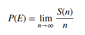

**Probability axioms**

1.  Positivity : Prob is always 0 \<= P(E) \<=1

2.  Probability of a certain event: P(S)=1

3.  Additivity Union of 2 exclusive sets = sum prob of individual events
    happening

    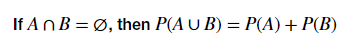

### Addition law of probability 

-   Prob of union of A and B is individual P minus intersection

    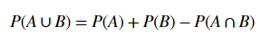

### HOW TO: test probability of an event: 

1.  What is the prob of E happening at least once?

    1.  Get Boolean result for E:  
        Set_E =sample_population == E

    2.  Verify condition:  
        true_E=np.any(set_E, axis = 1)

    3.  Prob_E=np.sum(true_E)/len(sample_population)

Permutations and Factorials:
----------------------------

### Permutations of a subset

How many ways can we select k elements out of a pool of n objects?

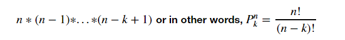

### Permutations with replacement 

\# of possible options doesn’t change, so n is raised to the power of j, the
number of draws from the pop

*nj*

### Permutations with repetition 

The \# of permutations of *n* objects with identical objects of type 1 (*n­1 )*
and type 2 ( *n2)*

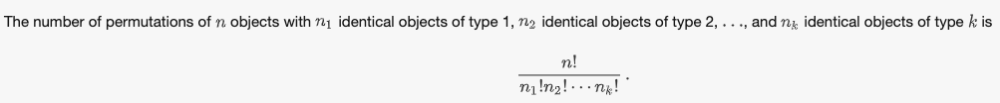

[./media/image6.png](./media/image6.png)
========================================

Statistical Distribtuions + Linear Regression

[./media/image7.png](./media/image7.png)
----------------------------------------

Discrete Distributions
----------------------

-   Bernoulli = Repeated trials of binary outcome event. ( x successes in n
    trials)(flipping a coin)

-   Geometric = Repeated trials, but examines the probability that the first
    success will occur on trial n.

-   Poisson = The probability of n events in a given time period when overall
    rate of occurrence is constant (i.e. receiving mail)

-   Uniform = all outcomes equally likely

Continuous Distributions
------------------------

-   Normal / gaussian = single ost important for data analysis, occurs very
    frequently in real-world

Stem & leaf plots
-----------------

The last major digit is convertd to category on x-axis, the ones-digits are then
plotted as Y-values (cannot see multiple instances of same value)


Import matplotlib.pyplot as plt  
%matplotlib inline  
plt.style.use(‘ggplot’)  
  
\# Create a stem and leaf plot including the above styling

plt.figure(figsize=(12,8))

\# markerline, stemlines, baseline =

plt.stem(stems, leafs, '-.', 'o' )

plt.title('Stem and Leaf Plot for Student Marks', fontsize = 30 )

plt.ylabel('Leafs', fontsize = 20)

plt.xlabel('Stems', fontsize = 20)

plt.show()

Probability Mass Function (PMF)
-------------------------------

-   Also called a Frequency Function. Converts frequency of events to
    probability of a particular outcome of a discrete function, by normalizing
    such that sum of all outcomes == 1.

-   Gives probability for discrete random variables, if we have x outcomes, we
    want to know what is the probability of getting k (our value of interest)
    from x

CUMULATIVE DENSITY FUNCTION

\-[etc[

PROBABILITY DENSITY FUNCTION

-   For continuous data, etc

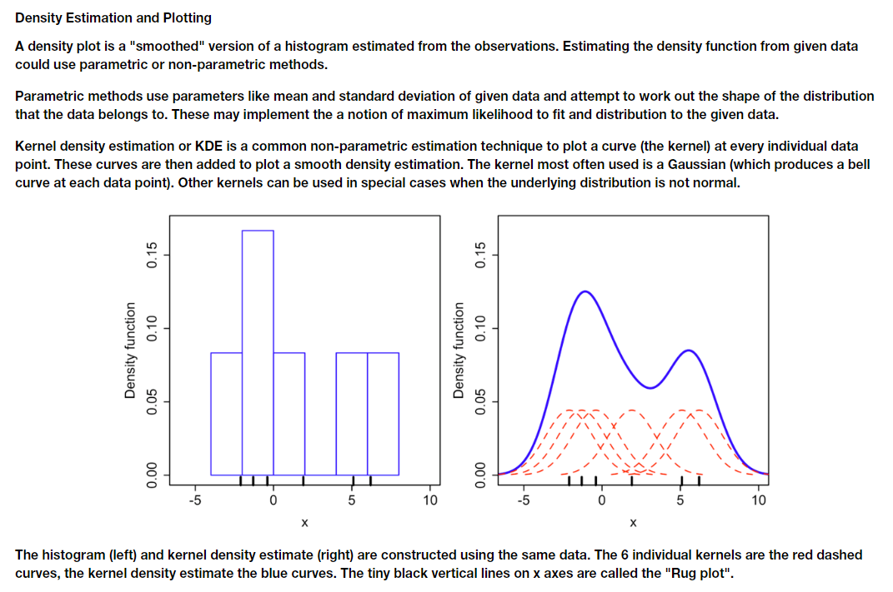

*\# How to convert freq - \> prob for PMF*  
import numpy as np  
import collections  
x = [1,1,1,1,2,2,2,2,3,3,4,5,5]

counter = collections.Counter(x)  
\# Convert frequency to probability - divide each frequency value by total
number of values

pmf = []

for key,val in counter.items():

pmf.append(round(val/len(x), 2))

print(counter.keys(), pmf)  
  
\#Proof that is normalized to overall prob of 1 (needed for PMF)  
np.array(pmf).sum()

*\# Visualizing PMF – similar to histogram, but normalized to P=1*  
import matplotlib.pyplot as plt  
plt.style.use(‘ggplot’)  
  
plt.stem(counter.keys(), pmf)  


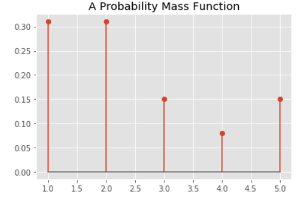

*Using statsmodels to run Ordinary Least Squares Regressions*
=============================================================

TESTING ASSUMPTIONS AND RUNNING LINEAR REGRESSION
-------------------------------------------------

\# For all the variables, check if they hold normality assumption

for column in data:

data[column].plot.hist(normed=True, label = column+' histogram')

data[column].plot.kde(label =column+' kde')

plt.legend()

plt.show()

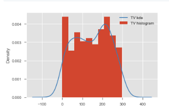

\# [Test linearity assumption] visualize the relationship between the preditors
and the target using scatterplots

fig, axs = plt.subplots(1, 3, sharey=True, figsize=(18, 6))

for idx, channel in enumerate(['TV', 'radio', 'newspaper']):

data.plot(kind='scatter', x=channel, y='sales', ax=axs[idx], label=channel)

plt.legend()

plt.show()

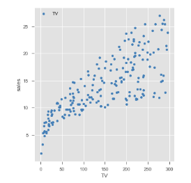

\-Run a simple regression in **statsmodels**

\# import libraries

import statsmodels.api as sm

import statsmodels.formula.api as smf

\# build the formula

f = 'sales\~TV'

\# create a fitted model in one line

model = smf.ols(formula=f, data=data).fit()

\-model.summary() \# Will spit out stastics and coefficients, R2

\-Draw the prediction line from the model with the scatter plot:  
[We can use model.predict() functions to predict start and end point of
regression line for min and max values in variable]

\# create a DataFrame with the minimum and maximum values of TV

X_new = pd.DataFrame({'TV': [data.TV.min(), data.TV.max()]})

print(X_new.head())

\# make predictions for those x values and store them

preds = model.predict(X_new)

print (preds)

\# first, plot the observed data and the least squares line

data.plot(kind='scatter', x='TV', y='sales')

plt.plot(X_new, preds, c='red', linewidth=2)

plt.show()

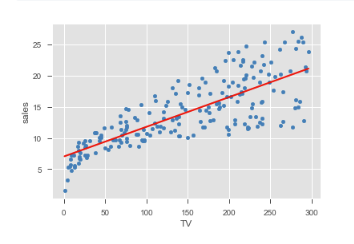

\-Visualize the error term for variance and heteroscedasticity:

fig = plt.figure(figsize=(15,8))

fig = sm.graphics.plot_regress_exog(model, "TV", fig=fig)

plt.show()

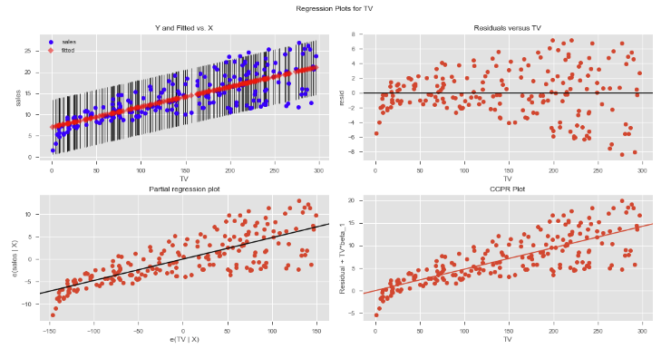

For the four graphs we see above:

-   The “Y and Fitted vs. X” graph plots the dependent variable against our
    predicted values with a confidence interval. The positive relationship shows
    that height and weight are correlated correlated, i.e., when one variable
    increases the other increases.

-   The “Residuals versus height” graph shows our model's errors versus the
    specified predictor variable. Each dot is an observed value; the line
    represents the mean of those observed values. Since there's no pattern in
    the distance between the dots and the mean value, the OLS assumption of
    homoskedasticity holds.

-   The “Partial regression plot” shows the relationship between height and
    weight, taking in to account the impact of adding other independent
    variables on our existing height coefficient. We'll see later how this same
    graph changes when we add more variables.

-   The Component and Component Plus Residual (CCPR) plot is an extension of the
    partial regression plot, but shows where our trend line would lie after
    adding the impact of adding our other independent variables on the weight.
    We shall look at this in more detail in multiple regression.

REGRESSION DIAGNOSTICS IN STATSMODELS
-------------------------------------

\-We’ve already used R2 value (from ols model.summary()) and visualization to
confirm if the data and residuals fit the assumptios. Here we will learn
procedures to further understand our model and results.

>   *Regression diagnostic is a set of procedures available for regression
>   analysis that seek to assess the validity of a model in any of a number of
>   different ways. This assessment may be an exploration of the model's
>   underlying statistical assumptions, an examination of the structure of the
>   model by considering formulations that have fewer, more or different
>   explanatory variables, or a study of subgroups of observations, looking for
>   those that are either poorly represented by the model (outliers) or that
>   have a relatively large effect on the regression model's predictions.*
>   [Wiki](https://en.wikipedia.org/wiki/Regression_diagnostic)

### Normality check with Q-Q Plots (also called normal density plots when used with standard normal quantiles)

These plots are good way to inspect the distribution of model errors.

import pandas as pd

import matplotlib.pyplot as plt

import statsmodels.api as sm

import statsmodels.stats.api as sms

import statsmodels.formula.api as smf

import scipy.stats as stats

plt.style.use('fivethirtyeight')

data = pd.read_csv('Advertising.csv', index_col=0)

**f = 'sales\~TV'**

**f2 = 'sales\~radio'**

**model = smf.ols(formula=f, data=data).fit()**

**model2 = smf.ols(formula=f2, data=data).fit()**

**resid1 = model.resid**

**resid2 = model2.resid**

**fig = sm.graphics.qqplot(resid1, dist=stats.norm, line='45', fit=True, )**

**fig = sm.graphics.qqplot(resid2, dist=stats.norm, line='45', fit=True)**

**fig.show()**

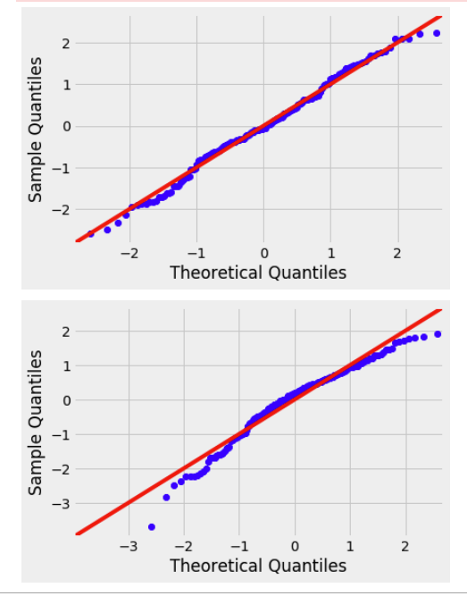

**Normal Q-Q Plots are a direct visual assessment of how well our residuals
match what we would expect from a normal distribution.**

In terms of Q-Q plots above, we can see that residuals are better normally
distributed in the case of TV than that of radio. We can also spot an outlier in
the left tail of radio residuals, dealing with this might help improve the
fitness of the model. Outliers, skew, heavy and light-tailed aspects of
distributions (all violations of normality) can be assessed from Q-Q plots

-   Example Q-Q plots vs histogram/density plot (to help learn what Q-Q plot is
    saying:

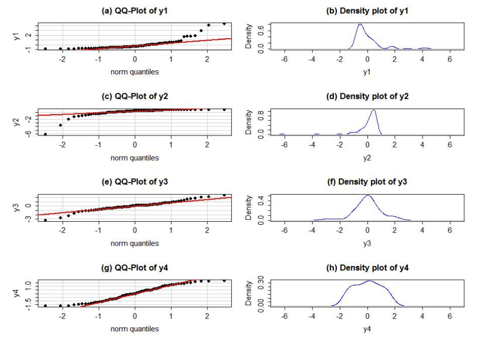

### Using the Jarque-Bera Test for Noramlity check

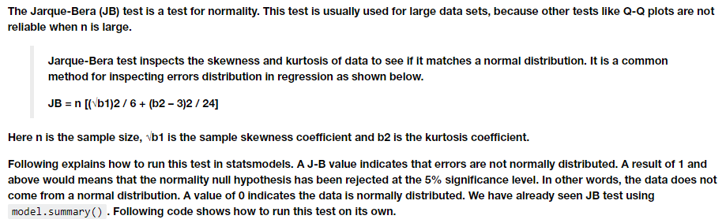

>   \# JB test for TV

>   name = ['Jarque-Bera','Prob','Skew', 'Kurtosis']

>   test = sms.jarque_bera(model.resid)

>   list(zip(name, test))

### Checking Heteroscedasticity (GOLDFELD-QUANDT test)

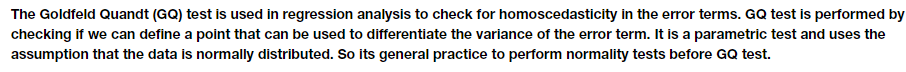

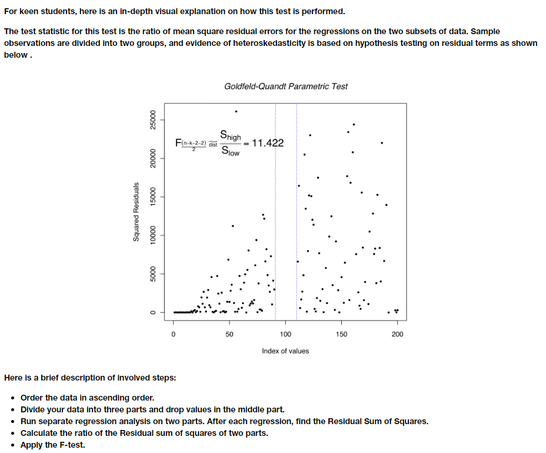

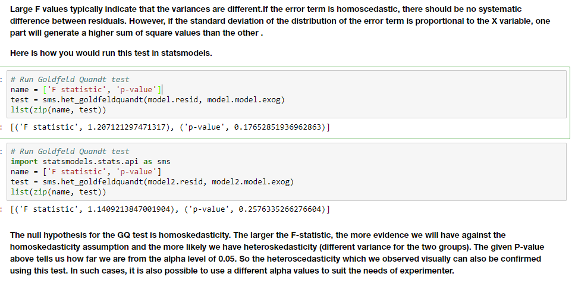

Recap:

*Multiple Linear Regression*
============================

\* HOW TO: BLOG POST ON LINEAR REGRESSION IN PYTHON
---------------------------------------------------

<https://www.dropbox.com/s/bzg4o8ndtu70byg/Linear%20Regression%20in%20Python%20-%20Blog%20Post.pdf?dl=0>

1.  Step 1: visualization

    1.  Look for linear relationship – use Seaborn’s pairplot  
        sns.pairplot(data, x_vars = [b1,b2,b3], y_vars=’Sales’,kind=’reg’)  
        \# Note, can also pass ‘size= “ for change plot size.  
        \# kind = ‘reg’ attempts to add line of best fit and 95% confidence
        ivtervanl (will aim to minimize the sum of squared error)

2.  Step 2: SK Learn – Setting Variables

    1.  Scikit-Learn expects X to be a ‘feature matrix’ (Pandas DataFrame) and y
        to be a ‘response vector’

    2.  X=dataframe. y = y from the dataframe

3.  Step 3: SK Learn – Splitting our data  
    from sklearn.cross_validation import test_train_split  
    X_train, X_test, y_train, y_test = train_test_split(X, y)

4.  Step 4: SK Learn – Training our model  
    \# Import linear regression and instantiate  
    from sklearn.linear_model import LinearRegression  
    linreg = LinearRegression()  
      
    \# Fit model to training data  
    linred.fit(X_train, y_train)

5.  Step 5: Interpreting Coefficients  
    print(lingreg.intercept_) \# prints y-intercept, BO  
    print(linreg.coef_) \# prints beta coeffiicents in same order as passed  
    zip(feature_cols, linreg.coef_) \# Pair feature names and coefficients

6.  Step 6: Making predictions  
    y_pred = linreg.predict(X_test)

7.  Step 7: Model Evaluation  
    from sklearn import metrics  
      
    \# Most popular metric to use is root-mean-square-error (RMSE)  
    print(np.sqrt(metrics.mean_squared_error(y_true, y_pred)))  
      
    \#People also use Mean Absolute Error or Mean-Squared Error, but harder to
    interpret

8.  Step 8: Feature selection:

    1.  Once have error metric, take note which X’s have minimal impact on y.

        1.  Removing some of these may increase the accuracy of the model

    2.  Now, process of trial and error, starting over again (dropping columns)
        until reach a satisfactory model

    3.  Recommended Steps

        1.  Replace feature_cols & X

        2.  Train_test_split your data

        3.  Fit the model to linreg again using linreg.fit

        4.  Make predictions using (y_pred = linreg.predict(X_test))

        5.  Compute RMSE

        6.  Repeat until RMSE satisfactory

### Code from: FEATURE SCALING AND NORMALIZATION LAB:

1.  Performing binning / as categories for numerical categorical variables for
    regression, create dummy variables ( and replace orig):

>   \# first, create bins for based on the values observed. 5 values will result
>   in 4 bins

>   bins = [0, 3, 4 , 5, 24]

>   bins_rad = pd.cut(boston_features['RAD'], bins)

>   bins_rad = bins_rad.cat.as_unordered()

>   \# first, create bins for based on the values observed. 5 values will result
>   in 4 bins

>   bins = [0, 250, 300, 360, 460, 712]

>   bins_tax = pd.cut(boston_features['TAX'], bins)

>   bins_tax = bins_tax.cat.as_unordered()

>   tax_dummy = pd.get_dummies(bins_tax, prefix="TAX")

>   rad_dummy = pd.get_dummies(bins_rad, prefix="RAD")

>   boston_features = boston_features.drop(["RAD","TAX"], axis=1)

>   boston_features = pd.concat([boston_features, rad_dummy, tax_dummy], axis=1)

>   boston_features = boston_features.drop("NOX",axis=1)

1.  Filtering out the columns of a dataframe using drop, filter, and regex :

>   df= boston_features

>   boston_cont = df[df.columns.drop(list(df.filter(regex='TAX')))]

>   boston_cont =
>   boston_cont[boston_cont.columns.drop(list(boston_cont.filter(regex='RAD')))]

>   boston_cont= boston_cont.drop(['CHAS'], axis=1)

1.  Different Tpes of transformations on the dataframe:

>   data_log = df_log

>   age = boston_cont["AGE"]

>   b = boston_cont["B"]

>   rm = boston_cont["RM"]

>   logcrim = data_log["CRIM"]

>   logdis = data_log["DIS"]

>   logindus = data_log["INDUS"]

>   loglstat = data_log["LSTAT"]

>   logptratio = data_log["PTRATIO"]

>   features_final= pd.DataFrame([])

>   features_final["CRIM"] = (logcrim-min(logcrim))/(max(logcrim)-min(logcrim))

>   features_final["B"] = (b-min(b))/(max(b)-min(b))

>   features_final["RM"] = (rm-min(rm))/(max(rm)-min(rm))

>   features_final["DIS"] = (logdis-np.mean(logdis))/np.sqrt(np.var(logdis))

>   features_final["INDUS"] =
>   (logindus-np.mean(logindus))/np.sqrt(np.var(logindus))

>   features_final["LSTAT"] =
>   (loglstat-np.mean(loglstat))/(max(loglstat)-min(loglstat))

>   features_final["AGE"] = (age-np.mean(age))/(max(age)-min(age))

>   features_final["PTRATIO"] = (logptratio)/(np.linalg.norm(logptratio))

### Code from: Regression modeling with Boston Housing Dataset

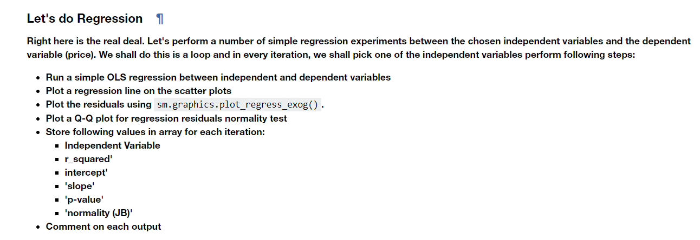

>   \# Your code here

>   import statsmodels.api as sm

>   import statsmodels.formula.api as smf

>   import scipy.stats as stats

>   import statsmodels.stats.api as sms

>   \# The results will be saved in results list

>   results = [['ind_var','r_sqared','intercept','slope','p-value','norm_JB']]

>   *\# TO LOOP THROUGH LIST OF DATACOLUMNS TO RUN OLS REGRESSION + PRINT/SAVE
>   RESULTS*

>   for idx, val in enumerate(['crim','dis','rm','zn','age']):

>   print ("Boston Housing DataSet - Regression Analysis and Diagnostics for
>   formula: medv\~" + val)

>   print
>   ("-------------------------------------------------------------------------------------")

>   f = 'medv\~' + val

>   model = smf.ols(formula=f,data=data).fit()

>   X_new = pd.DataFrame({val: [data[val].min(),data[val].max()]})

>   preds= model.predict(X_new)

>   data.plot(kind='scatter',x=val,y='medv')

>   plt.plot(X_new,preds,c='red',linewidth=2)

>   plt.show()

>   fig=plt.figure(figsize=(15,8))

>   fig = sm.graphics.plot_regress_exog(model, val, fig=fig)

>   fig = sm.graphics.qqplot(model.resid,dist=stats.norm, line='45',fit=True )

>   plt.show

>   results.append([val,model.rsquared,model.params[0],model.params[1],model.pvalues[1],sms.jarque_bera(model.resid)[0]])

>   input('Press Enter to continue...')

### Code from: Dealing with categorical variables lab

>   *\#Get list of column names (to use for plotting from df)*

>   names = boston_df.columns

>   nameList = [str(x) for x in names]

>   col_names = nameList[1:]

>   print(col_names)

*\# Loop through each column to plot*

>   for col in col_names:

>   plt.figure()

>   plt.scatter(boston_df[col],boston_df['MEDV'],label=col,marker='.')

>   plt.legend()

### REGRESSION MODEL VALIDATION

\-using train-test-split

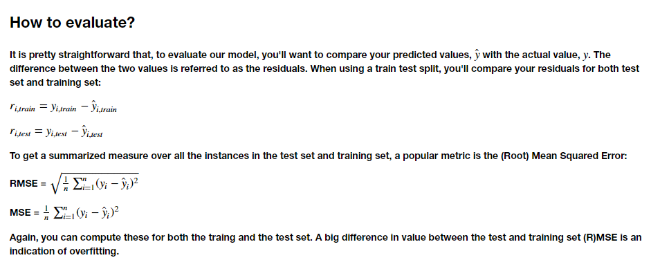

>   *\# Using train-test-split from sklearn*

>   from sklearn.model_selection import train_test_split

>   X_train, X_test, y_train, y_test = train_test_split(X, y, test_size = 0.2)

>   from sklearn.linear_model import LinearRegression  
>   lingreg=LinearRegression(X_train, y_train)

>   y_hat_train = linreg.predict(X_train)  
>   y_hat_test = linreg.predict(X_test)

>   train_residuals = y_hat_train – y_train  
>   test_residuals = y_hat_test – y_test

>   mse_train = np.sum((y_train – y_hat_train)\*\*2/len(y_train)  
>   mse_test = np.sum((y_test – y_hat_test)\*\*2/len(y_test)

**Select columns using regex**
------------------------------

df.filter(regex=('Mark'),axis=1).describe()

SECTION 12: COMPLETE PROJECT
============================

Modeling Our Data Lab/Lesson:
-----------------------------

-   Load in pre-cleaned file

    -   This is after having cleaned the dataset and made dummy variables.

    -   Must re-cast categories as categories when reloading data

-   If there are a lot of possible predictors, should try starting with single
    linear regressions (on CONTINUOUS)

    -   Using statsmodels.formula.api as smf

    >   import statsmodels.formula.api as smf  
    >   \# .describe used to select non-categorical values, then drop target var

    >   col_names = dataframe.describe().columns.drop([Target_Var'])

    >   results = [['ind_var', 'r_squared', 'intercept', 'slope', 'p-value' ]]

    >   *\# Use loop to run ols model with f=’Target_Variable\~’+val*  
    >   for idx, val in enumerate(col_names):

    >   print ("Walmart: Weekly_Sales\~" + val)

    >   print ("------------------------------")

    >   f = 'Weekly_Sales\~' + val

    >   model = smf.ols(formula=f, data=walmart).fit()

    >   X_new = pd.DataFrame({val: [walmart[val].min(), walmart[val].max()]});

    >   preds = model.predict(X_new)

    >   results.append([val, model.rsquared, model.params[0], model.params[1],
    >   model.pvalues[1] ])

    >   print(results[idx+1])  
    >   pd.DataFrame(results)

-   Examine outputs:

    -   What do the parameter estimates mean? Do they make sense?

    -   What do the p-values tell us?

    -   What does the R-squared tell us?

-   If poor R-squared, re-examine distributions

    -   Dataframe.hist()

    -   If skewed data can log transform:

        -   If negative data:

            -   walmart_log= walmart[walmart["Weekly_Sales"]\>0]

        -   walmart_log["Weekly_Sales"]= np.log(walmart_log["Weekly_Sales"])

    -   Re-run loop from earlier:

        -   compare and contract the results with the results obtained when we
            did not take the log(sales)

        -   Which one would you want to proceed with based on this?

-   Build a model with each category variable as a predictor (can re-run data vs
    data-log, re-examine the R-square output)

    -   Put all categories for one categorical variable in 1 model (so 4 models
        if 4 different categorical variables

        -   IF USED DUMMY CODES, MUST DROP 1 FOR BETTER RESULTS (not explained)

    -   Use output to judge choice of data vs data_log.

-   **Use the model results to identify variables that we can drop from the
    model.**

    -   Can do manually (drop from dataframe and re-run)

    -   **Can Use RECURSIVE FEATURE ELIMINATION FOR X NUMBER OF FEATURES**

        -   Create a for loop (below is 5-\>85 by 10’s)

    >   from sklearn.feature_selection import RFE

    >   from sklearn.linear_model import LinearRegression

    >   linreg = LinearRegression()

    >   r_list = []

    >   adj_r_list = []

    >   list_n = list(range(5,86,10))

    >   for n in list_n:

    >   select_n = RFE(linreg, n_features_to_select = n)

    >   select_n = select_n.fit(X, np.ravel(y))

    >   selected_columns = X.columns[select_n.support\_ ]

    >   linreg.fit(X[selected_columns],y)

    >   yhat = linreg.predict(X[selected_columns])

    >   SS_Residual = np.sum((y-yhat)\*\*2)

    >   SS_Total = np.sum((y-np.mean(y))\*\*2)

    >   r_squared = 1 - (float(SS_Residual))/SS_Total

    >   print(r_squared)

    >   adjusted_r_squared = 1 - (1-r_squared)\*(len(y)-1)/(len(y)-X.shape[1]-1)

    >   print(adjusted_r_squared)

    >   r_list.append(r_squared)

    >   adj_r_list.append(adjusted_r_squared)

“What we see is that both MSE keeps improving when we add variables. It seems
like a bigger model improves our performance, and the test and train performance
don't really diverge. It is important to note however that is not an unusual
result. The performance measures used typically will show this type of behavior.
In order to really be able to balance the curse of dimensionality (which will
become more important in machine learning), we need other information criteria
such as AIC and BIC. You'll learn about them later! Now, let's perform
cross-validation on our model with 85 predictors!”

-   Can do a 10-fold cross validation with the final model.

    >   from sklearn.metrics import mean_squared_error

    >   from sklearn.model_selection import cross_val_score

    >   \# select 85 best predictors

    >   select_85 = RFE(linreg, n_features_to_select = 85)

    >   select_85 = select_n.fit(X, np.ravel(y))

    >   selected_columns = X.columns[select_n.support_]

    >   cv_10_results = cross_val_score(linreg, X[selected_columns], y, cv=10,
    >   scoring="neg_mean_squared_error")

    >   cv_10_results

“Running our 10-fold cross-validation highlights some issues for sure! Have a
look at your list of 10 MSEs. Where most MSEs are manageable, some are very
high. The cure of dimensionality is already pretty clear here. The issue is that
we have many (dummy) categorical variables that result in columns with many
zeroes and few ones. This means that for some folds, there is a risk of ending
up with columns that almost exclusively contain 0's for prediction, which might
cause weird results. Looking at this, a model with less predictors might make
sense again. This is where we conclude for now. It's up to you now to explore
other model options! Additionally, it is encouraged to try some of the "level
up" exercises below. Good luck!”

Data Science Project Workflow Notes (section12)
===============================================

Order of Processing (using OSEMN model)
=======================================

1.  **OBTAIN: Import data, inspect, check for datatypes to convert and null
    values**

    -   Display header and info

    -   Drop any unneeded columns (df.drop(['col1','col2'],axis=1)

2.  **SCRUB: cast data types, identify outliers, check for multicollinearity,
    normalize data**

    -   Check and cast data types

        -    Check for \#'s that are store as objects (df.info())

            -   when converting to \#'s, look for odd values (like many 0's), or
                strings that can't be converted

            -   Decide how to deal weird/null values (df.unique(),
                df.isna().sum(), df.describe()-min/max, etc

        -    Check for categorical variables stored as integers (for now cast as
            strings)

    -   Check for missing values (df.isna().sum())

        -   Can drop rows or colums

        -   For missing numeric data with median or bin/convert to categorical

        -   For missing categorical data: make NaN own category OR replace with
            most common category

    -   Check for multicollinearity

        -   use seaborn to make correlation matrix plot [Evernote
            Link](https://www.evernote.com/l/AArNyaEwjA5JUL6I9PazHs_ts_hU-m7ja1I/)

            -   Good rule of thumb is anything over 0.75 corr is high, remove
                the variable that has the most correl with the largest \# of
                variables

    -   Normalize data (may want to do after some exploring)

        -   Most popular is Z-scoring (but won't fix skew)

        -   Can log-transform to fix skewed data

3.  **EXPLORE: Check distributions, outliers, etc**

    -   Check scales, ranges (df.describe())

    -   Use histograms to get an idea of distribut(df.hist())

        -   Can also do kernel density estimates

    -    use scatterplots to check for linearity and possible categorical
        variables (df.plot(kind-'scatter')

        -   categoricals will look like vertical lines

    -    Use pd.plotting.scatter_matrix to visualize possible relationships

    -   ADVANCED pair-wise comparison
        via [joint-plots](https://seaborn.pydata.org/generated/seaborn.jointplot.html)

        -   ns.jointplot(x= \<column\>, y= \<column\>, data=\<dataset\>,
            kind='reg')

    -   **Check for linearity**

4.  **Fit an intiial model**

    -   Various forms, detail later...

    -   **Assessing the model:**

        -   Assess parameters (slope,intercept)

        -   Check if the model explains the variation in the data (RMSE, F,
            R_square)

        -   *Are the coeffs, slopes, intercepts in appropriate units?*

        -   *Whats the impact of collinearity? Can we ignore?*

5.  **Revise the fitted model**

    -   Multicollinearity is big issue for lin regression and cannot fully
        remove it

    -   Use the predictive ability of model to test it (like R2 and RMSE)

    -   Check for missed non-linearity

6.  **Holdout validation / Train/test split**

    -   use sklearn train_test_split

Regular Expression in Beautiful Soup
====================================

>   \# Import required packages

>   from bs4 import BeautifulSoup

>   import pandas

>   import requests

>   import re

>   \#Use beautiful soup to get declared url

>   url = 'https://www.azlyrics.com/p/panicatthedisco.html' \#Put the URL of
>   your AZLyrics Artist Page here!

>   html_page = requests.get(url) \#Make a get request to retrieve the page

>   soup = BeautifulSoup(html_page.content, 'html.parser') \#Pass the page
>   contents to beautiful soup for parsing

>   \# Print html-nested structured result

>   print(soup.prettify()[:1000])

\# Get all links that have 'panic'

def get_links(soup,str='panic'):

link_list=[]

for link in soup.find_all('a'):

test_link = link.get('href')

if str in test_link:

link_list.append(test_link)

return link_list

>   panic_links = get_links(soup,’panic’)

>   \# Constructing reg exp to find the last 2 branches of web address (using /
>   / .html), and saves the band and song strings

>   pattern = **r**'\\/(?P\<band\>\\w\*)\\/(?P\<song\>\\w\*).html'

>   exp = re.compile(pattern) \# the exp is a re object and can be used in
>   methods OR functions.

>   \# save a list of the captured band and song tokens O

>   result = []

>   [result.append(exp.findall(x)) for x in panic_links]
